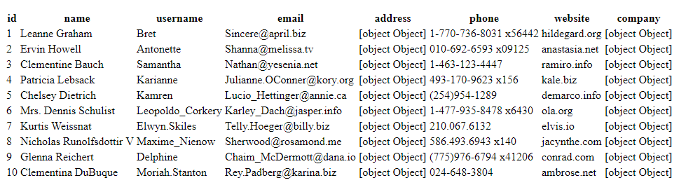

# Web Component Table
Es un web component sencillo, utilizando unicamente javascript puro [Custom Elements](https://developer.mozilla.org/en-US/docs/Web/Web_Components/Using_custom_elements) 

## Descripción
Su utilidad es generar una tabla dinamica a base de un archivo json

## Instalación 
Solo añade la etiqueta con la ubicación del archivo
```
<script src="src/webcomponent.js"></script>
```
## Uso
crea una etiqueta <wc-cetable></wc-cetable> con el atributo "jsonroot" dandole la ubicación del json para que genere la tabla, para este caso utilicé jsonplaceholder.
``` 
 <wc-cetable jsonroot="https://jsonplaceholder.typicode.com/users"></wc-cetable>

```


>La tabla *no posee CSS* pero añadirlo y editarlo a voluntad es sencillo, si tienes dudas al respecto hazmelas saber

## Créditos
[Victor Carranza](https://twitter.com/VktorHC)

## Licencia
[MIT](https://opensource.org/licenses/MIT)